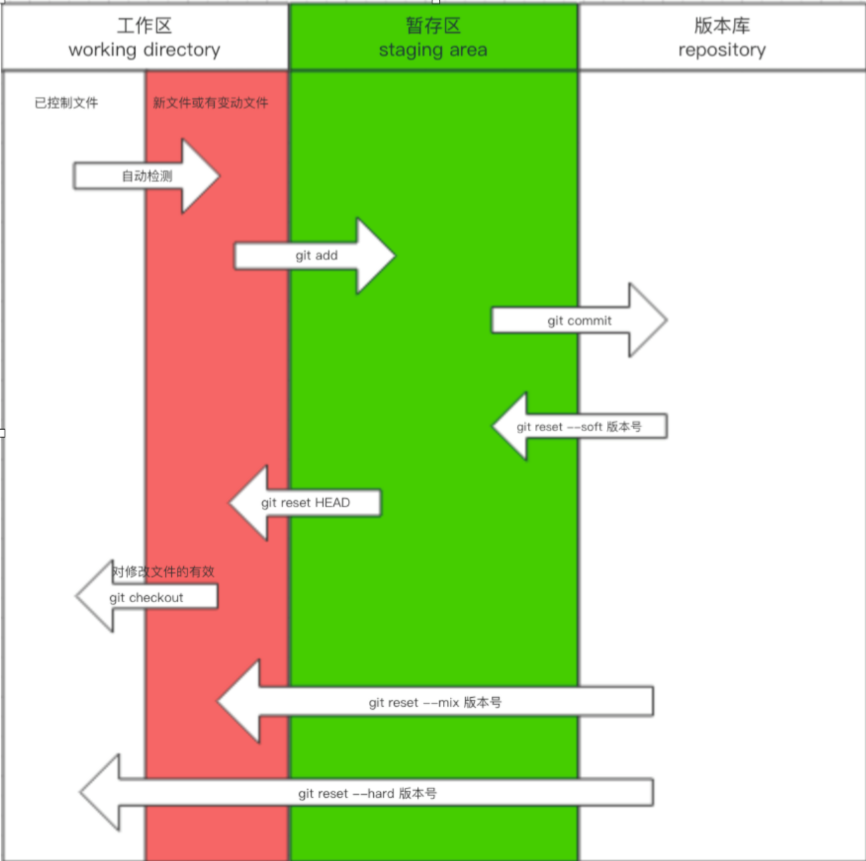

# 一.版本初始化

配置git：

git config --global user.name "xxx@xxx"

git config --global user.email "xxx@xxx"

进入文件夹 `git init`

# 二.版本管理基础

- 检查文件状态

  git status

  ```shell
  $ git status
  On branch master
  No commits yet
  Untracked files:
    (use "git add <file>..." to include in what will be committed)
          readme.md
          test.txt
  nothing added to commit but untracked files present (use "git add" to track)
  ```

- 文件加入版本管理

  git add filexxx

  ```shell
   $ git add .
   $ git status
  On branch master
  No commits yet
  Changes to be committed:
    (use "git rm --cached <file>..." to unstage)
          new file:   readme.md
          new file:   test.txt
  ```

- 生成版本

  git commit -m "xxxxxx"

  ```shell
  $ git commit -m "v0.0"
  [master (root-commit) e198374] v0.0
   2 files changed, 31 insertions(+)
   create mode 100644 readme.md
   create mode 100644 test.txt
  ```

  ```shell
  $ git status
  On branch master
  Changes not staged for commit:
    (use "git add <file>..." to update what will be committed)
    (use "git restore <file>..." to discard changes in working directory)
          modified:   readme.md
  no changes added to commit (use "git add" and/or "git commit -a")
  ```

# 三. git 三大区域



​    上图显示了git中的三大区域：工作区，暂存区，版本库。

　下面详细说一下两个命令：

```shell
git checkout
git reset HEAD
```

　　1、git checkout

　　当你修改了一个文件（demo.txt）之后，他会自动变红。此时输入命令git checkout - - demo.txt，他就会回到未修改的状态。

　　2、git reset HEAD

　　当你修改一个文件（demo.txt），然后git add之后，他就会变绿，进入暂存区，如果我想让他变红，回到工作区，输入命令git reset HEAD demo.txt 即可

# 四. 版本回退

当前状态

```shell
$ git log
commit bfc113f6790f6e7e730a679c44912ccaaca02ffc (HEAD -> master)
Author: ccdroid <hongchunbo@hotmail.com>
Date:   Mon Jan 11 14:40:08 2021 +0800

    v0.2 version 0.2

commit ecb18e4b4bb3b4108a86c52d4708e0dc083417db
Author: ccdroid <hongchunbo@hotmail.com>
Date:   Mon Jan 11 14:39:00 2021 +0800

    v0.1 version0.1

commit 1d2519296736004848b728f56563b40ecd7caeea
Author: ccdroid <hongchunbo@hotmail.com>
Date:   Mon Jan 11 14:33:06 2021 +0800

    v0.0rc2 git三大区域

commit 16f005fa2931f677238b909ab7b0795def404050
Author: ccdroid <hongchunbo@hotmail.com>
Date:   Mon Jan 11 14:04:28 2021 +0800

    v0.0r1 version init and add md doc

commit e198374300602fde86ae0c218f992e4e9f79c82e
Author: ccdroid <hongchunbo@hotmail.com>
Date:   Mon Jan 11 13:49:33 2021 +0800

    v0.0
```

回退到 v0.1

```shell
$ git reset --hard ecb18e4b4bb3b4108a86c52d4708e0dc083417db
HEAD is now at ecb18e4 v0.1 version0.1

$ git log
commit ecb18e4b4bb3b4108a86c52d4708e0dc083417db (HEAD -> master)
Author: ccdroid <hongchunbo@hotmail.com>
Date:   Mon Jan 11 14:39:00 2021 +0800

    v0.1 version0.1

commit 1d2519296736004848b728f56563b40ecd7caeea
Author: ccdroid <hongchunbo@hotmail.com>
Date:   Mon Jan 11 14:33:06 2021 +0800

    v0.0rc2 git三大区域

commit 16f005fa2931f677238b909ab7b0795def404050
Author: ccdroid <hongchunbo@hotmail.com>
Date:   Mon Jan 11 14:04:28 2021 +0800

    v0.0r1 version init and add md doc

commit e198374300602fde86ae0c218f992e4e9f79c82e
Author: ccdroid <hongchunbo@hotmail.com>
Date:   Mon Jan 11 13:49:33 2021 +0800

    v0.0

```

回退到v0.2

```shell
$ git reflog
ecb18e4 (HEAD -> master) HEAD@{0}: reset: moving to ecb18e4b4bb3b4108a86c52d4708e0dc083417db
bfc113f HEAD@{1}: reset: moving to HEAD
bfc113f HEAD@{2}: reset: moving to HEAD
bfc113f HEAD@{3}: commit: v0.2 version 0.2
ecb18e4 (HEAD -> master) HEAD@{4}: commit: v0.1 version0.1
1d25192 HEAD@{5}: commit: v0.0rc2 git三大区域
16f005f HEAD@{6}: commit: v0.0r1 version init and add md doc
e198374 HEAD@{7}: commit (initial): v0.0
```

```shell
$ git reset --hard bfc113f
HEAD is now at bfc113f v0.2 version 0.2
```

```shell
$ git log
commit bfc113f6790f6e7e730a679c44912ccaaca02ffc (HEAD -> master)
Author: ccdroid <hongchunbo@hotmail.com>
Date:   Mon Jan 11 14:40:08 2021 +0800

    v0.2 version 0.2

commit ecb18e4b4bb3b4108a86c52d4708e0dc083417db
Author: ccdroid <hongchunbo@hotmail.com>
Date:   Mon Jan 11 14:39:00 2021 +0800

    v0.1 version0.1

commit 1d2519296736004848b728f56563b40ecd7caeea
Author: ccdroid <hongchunbo@hotmail.com>
Date:   Mon Jan 11 14:33:06 2021 +0800

    v0.0rc2 git三大区域

commit 16f005fa2931f677238b909ab7b0795def404050
Author: ccdroid <hongchunbo@hotmail.com>
Date:   Mon Jan 11 14:04:28 2021 +0800

    v0.0r1 version init and add md doc

commit e198374300602fde86ae0c218f992e4e9f79c82e
Author: ccdroid <hongchunbo@hotmail.com>
Date:   Mon Jan 11 13:49:33 2021 +0800

    v0.0
```

# 五.分支和冲突

场景：在v0.2的基础上继续开发v0.3，这时v0.2线上产生bug，这时就需要使用分支管理来解决问题

思路：v0.3使用新分支dev，出现bug站厅，切换到bug分支，解决完bug，将bug分支的代码合并到master，再切换回dev分支继续开发，开发完成后将v0.3合并到master，可能产生冲突，需要手动解决分支，再commit到master

具体过程如下：

- 当前状态

```
$ git log
commit 4f470498efd2e4d1e9cb1270215ac5586789cb4a (HEAD -> master)
Author: ccdroid <hongchunbo@hotmail.com>
Date:   Mon Jan 11 15:15:39 2021 +0800

    v0.2rc1 添加回退md文档

commit bfc113f6790f6e7e730a679c44912ccaaca02ffc
Author: ccdroid <hongchunbo@hotmail.com>
Date:   Mon Jan 11 14:40:08 2021 +0800

    v0.2 version 0.2

commit ecb18e4b4bb3b4108a86c52d4708e0dc083417db
Author: ccdroid <hongchunbo@hotmail.com>
Date:   Mon Jan 11 14:39:00 2021 +0800

    v0.1 version0.1

commit 1d2519296736004848b728f56563b40ecd7caeea
Author: ccdroid <hongchunbo@hotmail.com>
Date:   Mon Jan 11 14:33:06 2021 +0800

    v0.0rc2 git三大区域

commit 16f005fa2931f677238b909ab7b0795def404050
Author: ccdroid <hongchunbo@hotmail.com>
Date:   Mon Jan 11 14:04:28 2021 +0800

    v0.0r1 version init and add md doc

commit e198374300602fde86ae0c218f992e4e9f79c82e
Author: ccdroid <hongchunbo@hotmail.com>
Date:   Mon Jan 11 13:49:33 2021 +0800

    v0.0

```

- 创建新分支dev

```
$ git branch
* master

$ git branch dev

$ git branch
  dev
* master

$ git checkout dev

$ git branch
* dev
  master
  
$ git status
On branch dev
Changes not staged for commit:
  (use "git add <file>..." to update what will be committed)
  (use "git restore <file>..." to discard changes in working directory)
        modified:   test.txt

no changes added to commit (use "git add" and/or "git commit -a")
```

- 修复bug

思路保存当前dev状态，切换回master，创建bug分支修复bug

```
$ git checkout master
Switched to branch 'master

$ git branch bug

$ git checkout bug
Switched to branch 'bug'

$ git status
On branch bug
Changes not staged for commit:
  (use "git add <file>..." to update what will be committed)
  (use "git restore <file>..." to discard changes in working directory)
        modified:   test.txt

no changes added to commit (use "git add" and/or "git commit -a")

$ git add .

$ git commit -m "v0.2 bug fixed"
[bug 7cd20ad] v0.2 bug fixed
 1 file changed, 2 insertions(+), 1 deletion(-)
```

- 合并到master分支

```
$ git checkout master
Switched to branch 'master'

$ git merge bug
Updating 4f47049..7cd20ad
Fast-forward
 test.txt | 3 ++-
 1 file changed, 2 insertions(+), 1 deletion(-)
 
$ git log
commit 7cd20ad0a7dbf73a948f5c2dab29c6703085fbb3 (HEAD -> master, bug)
Author: ccdroid <hongchunbo@hotmail.com>
Date:   Mon Jan 11 16:04:08 2021 +0800

    v0.2 bug fixed

commit 4f470498efd2e4d1e9cb1270215ac5586789cb4a
Author: ccdroid <hongchunbo@hotmail.com>
Date:   Mon Jan 11 15:15:39 2021 +0800

    v0.2rc1 添加回退md文档

commit bfc113f6790f6e7e730a679c44912ccaaca02ffc
Author: ccdroid <hongchunbo@hotmail.com>
Date:   Mon Jan 11 14:40:08 2021 +0800

    v0.2 version 0.2

commit ecb18e4b4bb3b4108a86c52d4708e0dc083417db
Author: ccdroid <hongchunbo@hotmail.com>
Date:   Mon Jan 11 14:39:00 2021 +0800

    v0.1 version0.1

commit 1d2519296736004848b728f56563b40ecd7caeea
Author: ccdroid <hongchunbo@hotmail.com>
Date:   Mon Jan 11 14:33:06 2021 +0800

    v0.0rc2 git三大区域

commit 16f005fa2931f677238b909ab7b0795def404050
Author: ccdroid <hongchunbo@hotmail.com>
Date:   Mon Jan 11 14:04:28 2021 +0800

    v0.0r1 version init and add md doc

commit e198374300602fde86ae0c218f992e4e9f79c82e
Author: ccdroid <hongchunbo@hotmail.com>
Date:   Mon Jan 11 13:49:33 2021 +0800

    v0.0
```

bug 分支已经不再需要，删除bug分支

```
$ git branch -d bug
Deleted branch bug (was 7cd20ad).
```

- 继续开发v0.3并合并到master

```
$ git checkout dev
Switched to branch 'dev'

$ git status
On branch dev
Changes not staged for commit:
  (use "git add <file>..." to update what will be committed)
  (use "git restore <file>..." to discard changes in working directory)
        modified:   test.txt

no changes added to commit (use "git add" and/or "git commit -a")

$ git add .

$ git commit -m "v0.3 complete"
[dev f4a1ce5] v0.3 complete
 1 file changed, 1 insertion(+)

$ git checkout master
Switched to branch 'master'
$ git merge dev
Auto-merging test.txt
CONFLICT (content): Merge conflict in test.txt
Automatic merge failed; fix conflicts and then commit the result.
```

- 解决冲突，手动修改

冲突

```
版本初始化v0.0
版本1 v0.1
版本2 v0.2
<<<<<<< HEAD
版本2 bug修复
=======
版本3 v0.3 50%
版本3 v0.3 完成
>>>>>>> dev
```

手动修改

```
$ git status
On branch master
You have unmerged paths.
  (fix conflicts and run "git commit")
  (use "git merge --abort" to abort the merge)

Unmerged paths:
  (use "git add <file>..." to mark resolution)
        both modified:   test.txt

no changes added to commit (use "git add" and/or "git commit -a")
```

```
$ git add .
$ git commit -m "fixed master merge dev conflict"
[master 01d37ee] fixed master merge dev conflict
```

```
$ git status
On branch master
nothing to commit, working tree clean

Admin@DESKTOP-UH9B6PP MINGW64 /d/coding/git-learn (master)
$ git log
commit 01d37eefd422c7a9d2f9143b88eb89401baeed4d (HEAD -> master)
Merge: 7cd20ad f4a1ce5
Author: ccdroid <hongchunbo@hotmail.com>
Date:   Mon Jan 11 16:14:44 2021 +0800

    fixed master merge dev conflict

commit f4a1ce5926fe0c910c53613e437af4199a1bac34 (dev)
Author: ccdroid <hongchunbo@hotmail.com>
Date:   Mon Jan 11 16:10:10 2021 +0800

    v0.3 complete

commit 7cd20ad0a7dbf73a948f5c2dab29c6703085fbb3
Author: ccdroid <hongchunbo@hotmail.com>
Date:   Mon Jan 11 16:04:08 2021 +0800

    v0.2 bug fixed
```

dev分支任务完成，删除分支

```
$ git branch
  dev
* master

$ git branch -d dev
Deleted branch dev (was f4a1ce5).

```

这样便完成的v0.3开发和bug的修复，同时保证了主线master的一致性


